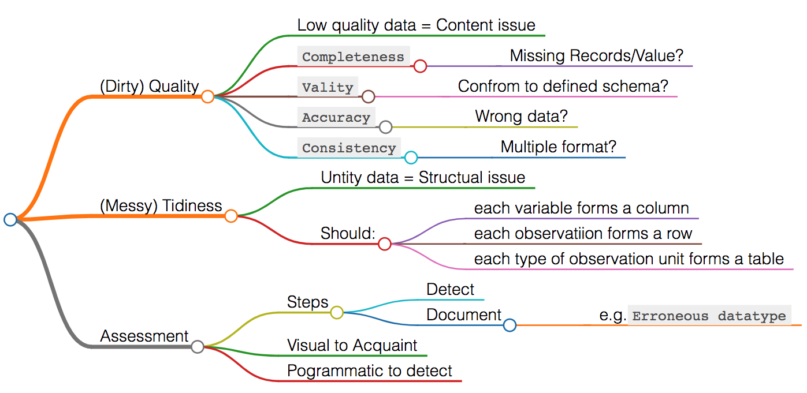

# Data Analysis Process
### Outline 
<ul>
<li><a href="#L2">Data Analysis Process Overview</a></li>
<li><a href="#L3">Data Wrangling</a></li>
<ul><li><a href="#L2.1">Gathering Data</a></li>
    <li><a href="#L2.2">Access Data</a></li>
    <li><a href="#L2.3">Clean Data</a></li>
</ul>
<li><a href="#Lextra">Additional</a></li>
<ul><li><a href="#Lextra_1"> System Command</a></li>
    <li><a href="#Lextra_2">SQL connection</a></li>
    <li><a href="#Lextra_3">Regex</a></li>
  
</ul>
</ul>

****
<a id='L2'></a>
## Data Analysis Process Overview

- **Step 1: Ask questions**   

  Ask questions based on data or before gather data to help to focus on relevant parts of data and direct analysis towards meaniful insights.  

- **Step 2: Wrangle data**
  - gather: retrieve and read data  
  - assess: identify problems in data's quality or structure 
  - clean : by modifying, replacing, or removing data 


- **Step 3: Perform EDA (Exploratory Data Analysis)**
   Explore and augment data to maximize the potential of analysis, visualizations, and models including
  - finding pattern 
  - visulizing relationship 
  - building intuition about the data 
  - feature engineering (remove outliers and create better features)

- **Step 4: Draw conclusions (or even make predictions)**
Typically approached with machine learning or inferential statistics.

- **Step 5: Communicate your results**
  - Justify and convey meaning in the insights found. 
  - Or, if the end goal is to build a system, then need to share what been built, explain how we reached design decisions, and report how well it performs. 

**** 

<a id='L3'></a>

## Data Wrangling: 
<a id='L2.1'></a>
### 1. Gather Data
<a id='L4'>Userful OS command</a>
#### Raw File
* **`glob`** from file handle
  Opening files with similar path sturcture
  ```
  import glob 

  for file in glob.glob('subfolder/*.txt'):
     with open(file, encoding ='utf-8' ) as file: 
          # if wantt read only 1 line 
          file.readline() 

          # read the context 
          review_text = file.read()
  ```
* **Request online**
  ```
  import requests 
  import os 

  folder_name = "online_content"
  if not os.path.exists(folder_name):
      os.makedirs(folder_name)

  url = "http: xxx"
  response = requests.get(url)
  # can get the content inside response
  response.content
  ```

* **read HTML**
  - workbook with bs4 ([link](GatherData_bs4.html))


#### Prepared Files
* **unzip**
  ```
  import zipfile  
  with ZipFile('file.zip', 'r') as myzip:    
        myzip.extractall()
  ```

* **Read**
`label`  to change the column name 
`header` if 0 then the frist line of the data; None then nothing; 1 is the second line of the data
`index` False to ingnore the index
`sep` sepecify the delimiter
  ```
  labels = ['col1', 'col2', 'col3']  
  df = pd.read_csv('data.csv', names=labels, index = False)   
  ```

****
<a id='L2.2'></a>
### 2.  Access and Build Intuition

- **More**
    - `Completeness` : All the records we shoud have? 
    - `Vality` : are the records valid? e.g conform to defined schema or not (4 digit zip code?)
    - `Accuracy` : wrong data but valid data e.g. (10 pounds adult) 
    - `Consistency` : valid and accurate! (for example showing NY and New york) 
 
- **Goal**
  Detect and Document issues need to be addressed. 
  Possible documenting phrase:
  > Erroneous datatype (zip_code, ); 
    Multiple data format in column xxx; 
    x is a float not string;
    Full state names sometimes, abbreviations other times 
      
  
  

* **basic funtions**  
  `shape()` | `dtypes` | `describe()` | `info()` | `unique()` |`value_counts() ` | `sort_values()`


****
<a id='L2.3'></a>
### 3. Clean Data

**Stpes** 
1. **Define:** convert assessment into defined cleaning tasks, start with action word. Like how-to guide of pseudo code:
   > Remove xx before every animal name using string slicing;
     Replace ! with . in body weight and brain weight columns;
     **Recalculate| Melt| Extract| Isolate**
2. **Code:** convert definition to code
3. **Test:** test the dataset (like using assert statement)
    * **assert**
   check if every text in a `asap_list` is in `df.startDate.values`
   ```
   for phrase in asap_list:
      assert phrase not in df.startDate.values
   ```
  
* **rename columns** 
  ```
  # Work from df 
  df.rename(columns ={'A' :'A1'}, inplace = True)
  df.rename(INDEX ={0:'A1'})
  ```
  - replace space with underscores and lowercase label 
  `df.rename(columns=lambda x: x.strip().lower().replace(" ", "_"), inplace=True)`
  - check two dataframe's columns if identical 
  `(df.columns == df2.columns).all()`

* **incorrect data types**
`df['timestamp'] = pd.to_datetime(df['timestamp']) `
`df[col] = df[col].astype(str/int/float/category)`
string in col `df[df.col.str.contains('?')]` <p>
</p>

* **Missing values** 
  - **check**
number of rows have missing value `df.isnull().any(axis = 1).sum()`
number of col have missing value `df.isnull().any(axis = 0).sum()`
    ```
    # example impute by mean
    mean = df.col.mean()   
    df.col = df.col.fillna(mean, inplace = True)
    ```
  - **drop** missing records
      `df.drop(['col','col'], axis = 1, inplace = True)`  
      - drop rows with NA 
      `df.dropna(axis = 0, inplace = True)`  
      or drop row with idx 
      `df.drop((df.query('age == -1')).index[0])`
      - drop cols with NA 
      `df.dropna(axis = 1, inplace = True)` 

  - **Imputing**
     - filling missing data values with other values. 
     - Zip code pad to 5 digit 
        `df.zip_code.astype(str).str.pad(5,fillchar='0')` 
* **duplicates** 
`df.duplicated()` gives boolean result 
`sum(df.duplicates())` gives the number of duplicates records 
`df.drop_duplicates()`

* **`query`**: 
  - selected rows by indexing with a mask
    `df.query('col == "Y"')`
  - easy to subset
  `low = df.query('alcohol < {}'.format(df['alcohol'].median()))`
  - select condition 
  `df.query('col in ["val1", "vla2"]')`

* **String extraction**
 Review: <a href="#Lextra_3">Regex</a>
 `serious.str.extract(r'([ab])?(\d)')`
* **Reshape**
  - **melt()**
  ```
  pd.melt(df,   
          id_vars =[]  #column(s) to use as identifier variables   
          value_vars =[] #column(s) to unpivot),
          var_name = ''   #name to use for variable's name,
          value_name = ''  # used for value column,
  ```
**** 
<a id='Lextra'></a>
## Additional

<a id='Lextra_1'></a>
### 1. System Command
1. Current working directory `pwd`
2. List files in current dir  `os.listdir()`
3. List files in subdir 
   ```
   listOfFiles = list()
   for (dirpath, dirnames, filenames) in os.walk(subdir):
      listOfFiles += [os.path.join(dirpath, f) for f in filenames]  
   ```
4. New a directory in current dir  `os.makedirs()`
   - Make a directory if it doesn't already exist 
  
     ```
     folder_name = 'ebert_reviews'
     if not os.path.exists(folder_name):
          os.makedirs(folder_name)
     ``` 


5. Full Path
   
6. Loop file in a folder 
   - use `os`
   ```
   for file_ele in os.listdir(folder):
      with open(os.path.join(folder, file_ele)) as file:
          soup = BeautifulSoup(file, 'lxml') 
   ```
   - use `glob`
   ```
   import glob

   for file in glob.glob('subdoler/*.txt'):
   ```
<a id='Lextra_2'></a>
### 2. SQL connection 
- SQL Alchemy
`from sqlalchemy import create_engine` 
create engine 
`engine = create_engine('sqlite:///bestofrt.db')`
store data to engine 
`df.to_sql('master', engine, index=False)`
Read data 
`df_gather = pd.read_sql('SELECT * FROM master', engine)`

<a id='Lextra_3'></a>
### 3. Regex 
[Regex](https://regexone.com/)
<table>
<thead>
  <tr>
    <th>Expression</th>
    <th>Character</th>
    <th>Notes</th>
  </tr>
</thead>
<tbody>
  <tr>
    <td>Letters</td>
    <td>abc</td>
    <td></td>
  </tr>
  <tr>
    <td>Digit</td>
    <td>\d </td>
    <td>any digit from 0 to 9</td>
  </tr>
  <tr>
    <td>Non-digit Character</td>
    <td>\D</td>
    <td></td>
  </tr>
  <tr>
    <td>Wildcard</td>
    <td>. </td>
    <td>match any signle charater (letter,digit,whitespace..)</td>
  </tr>
  <tr>
    <td>only a,b, or c<br>startwith</td>
    <td>[abc]</td>
    <td>only match a single a, b, or c letter and nothing else</td>
  </tr>
  <tr>
    <td>not a,b, nor c<br>notstartwith</td>
    <td>[^abc]</td>
    <td>match any single character except for</td>
  </tr>
  <tr>
    <td>characters a to z</td>
    <td>[a-z]</td>
    <td></td>
  </tr>
  <tr>
    <td>numbers 0 to 0</td>
    <td>[0-9]</td>
    <td></td>
  </tr>
  <tr>
    <td>any alphanumeric character</td>
    <td>\w</td>
    <td></td>
  </tr>
  <tr>
    <td>any non-alphanumeric character</td>
    <td>\W</td>
    <td></td>
  </tr>
  <tr>
    <td>m Repetitions</td>
    <td>{m}</td>
    <td>a{3} match a character exactly three times<br>[xyz]{5} five characters, each of which can be x,y, or z</td>
  </tr>
  <tr>
    <td>zero or more repetitions</td>
    <td>*</td>
    <td>.*&nbsp;&nbsp;zero or more of any character </td>
  </tr>
  <tr>
    <td>1 or more repetitions</td>
    <td>+</td>
    <td>x+ one or more x</td>
  </tr>
  <tr>
    <td>optional character</td>
    <td>?</td>
    <td>ab?c matches "abc" or "ac"</td>
  </tr>
  <tr>
    <td>any whitespace</td>
    <td>\s</td>
    <td></td>
  </tr>
  <tr>
    <td>any non-whitespace</td>
    <td>\S</td>
    <td></td>
  </tr>
  <tr>
    <td>starts and ends</td>
    <td>^...$</td>
    <td>^success only matches the word success<br>[^..] in the bracket is for excluding characters</td>
  </tr>
  <tr>
    <td>capture group</td>
    <td>(...)</td>
    <td>^(file.+).pdf$ matches<br>file_record_transcript.pdf and file_099.pdf</td>
  </tr>
  <tr>
    <td>capture subgroup</td>
    <td>(a(bc))</td>
    <td></td>
  </tr>
  <tr>
    <td>capture all</td>
    <td>(.*)</td>
    <td></td>
  </tr>
  <tr>
    <td>matches abc or def</td>
    <td>(abc|def)</td>
    <td>([cb]ats*|[dh]ogs?) would match either cats or bats, or dogs or hogs</td>
  </tr>
</tbody>
</table>

- Match all numbers 
  numberset = `[3.145, -255.31, 128,  1.9e1, 123,340.0 ]` 
  Code = `^-?\d+(,\d+)*(\.\d+(e\d+)?)?$`  
  
- Capture HTML tags 
  Text = ` [	<a>This is a link</a>,   
           <a href='https://regexone.com'>Link</a>,
           <div class='test_style'>Test</div> ] `
  Code = `(\w+)`

- Phone numbers 
  with format = `xxx-xxx-xxxx,  +1 (xxx)xxx-xxxx,  xxx xxx xxxx`
  `((?:\+\d{1,2}\s)?\(?\d{3}\)?[\s.-]?\d{3}[\s.-]?\d{4})`

- Email address 
  `([a-zA-Z][a-zA-Z0-9_.+-]+@[a-zA-Z0-9-]+\.[a-zA-Z0-9-.]+[a-zA-Z])`