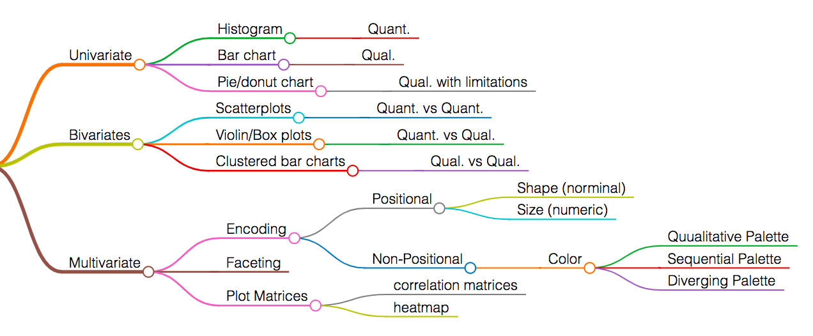
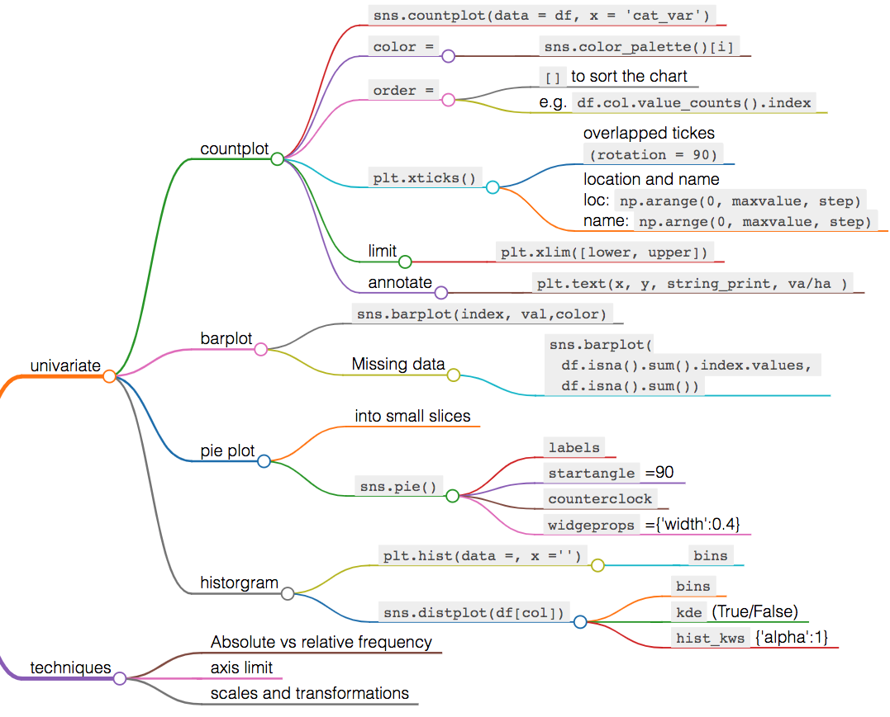
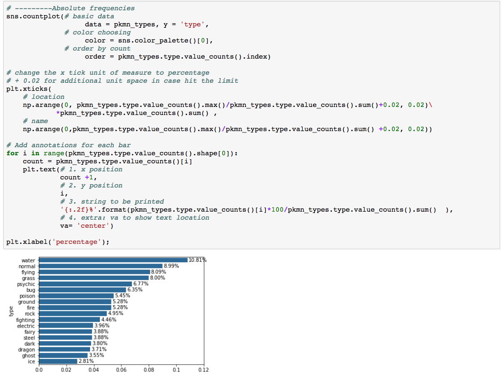
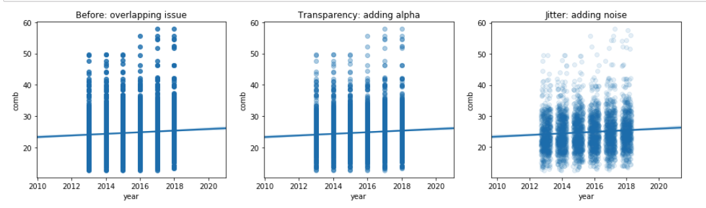

# Visualizations 

### Outline 
<ul>
<li><a href="#LIntro">Overview</a></li>
<li><a href="#L1">Exploratory: Descriptive</a></li>
<li><a href="#L2">Explanatory: EDA (Explore and Augment)</a></li>
<li><a href="#L_add">Additional</a></li>
</ul>

****

<a id='LIntro'></a>
## Overview 
**Data-ink Ratio**: 
- The more of the ink in your visual that is related to conveying the message in the data, the better.

**Lie Factor**
- Lie factor depicts the degree to which a visualization distorts or misrepresents the data values being plotted.
- $\displaystyle lie \ factor = \frac{\Delta visual / visual_{start}}{\Delta data / data_{start}}$
- If lie factor is greater than 1, then it sugguest the visual is misleading. 


****
<a id='L1'></a>
## Exploration visulizations
  *OR Descriptive visuals*


### Univariate  [link](DataVisuals/Univariate.html)


* **Count plot**
  
### Bivariate


* **Scatter plot**
  -  Show correlation 
  -  `plt.scatter (data = df, x =, y= )`
  -  `sns.regplot(data = df, x =, y= )`

* **Heat Maps**
  -  Show relationship of 2 discret variables 
  -  `plt.hist2d(data = df, x= , y= )`
     -  `cmin`
        bins with no counts will return not a number then not colored
     -  `cmap` = 
        color with `_r` which means reversed color map for example = `'viridis_r'`
     -  `bins = [binx, biny]`

* **Overplotting Issue**
  
  - [Overplotting](https://www.youtube.com/watch?time_continue=153&v=BGqR-nxgMtg&feature=emb_logo) : high amount of overlap in points makes it difficult to see the actual relationship between the plotted variables. 
  - Solve:
    - Sampling 
    - Transparency 
      - adding alpha so that the more points show darker image 
      -  `plt.scatter(data = df, x = 'disc_var1', y = 'disc_var2', alpha = 1/5)`
    - Jitter
      - move the position of each point slightly from its true value. 
      - each point to be plotted in a uniform +- 0.2 range of their true value 
       ```
        sns.regplot(\
            data = df, x = 'var1', y = 'var2', \
            fit_reg = False,
            x_jitter = 0.2, y_jitter = 0.2,\
            scatter_kws = {'alpha' : 1/3})
        ```
  
### Multivariate
- Encoding for third variables 
  - positional 
    - Size 
    - Shape 
  - non positional
    - color 
      1. **Qualitative** (all up to 6 colors): `'deep', 'pastel', 'dark', 'muted', 'bright', 'colorblind'`
      2. **Sequential:** `'rocket'` (white-orange-red-purple-black), `'mako'` (mint-green-blue-purple-black)
      3. **Diverging:** `'vlag'` (blue-white-red), `'icefire'` (blue-black-orange)
- Faceting 
****
<a id='L2'></a>
## Explanatory Visualizations
Are primaryily about conveying a message or story. They should grab reader's attention, and clearly convey a messgae that conveys a specific feeling or a call to action. 

### Story telling 
**Steps:**
1. Start with a Question
2. Repetition is a Good Thing
3. Highlight the Answer
4. Call Your Audience To Action

**Checklist:**
- appropriate plot type and encodings 
- good design integrity (data-ink ratio, lie-factor, no chart junk)
- labeled axes, reasonable tick marks 
- descriptive legends and title
- provide title and comments (title for whole, `subtitle` for subplotting)

**Slide Deck**
- Setting: 
  - Markdown cell
    - Slide Type = `Slide` main flow of the slide deck 
  - Code Cell 
    - code process = `Skip`
    - code generate visuals =`subslide`

- Convert: 
  - To terminal 
    `$ jupyter nbconvert presentation.ipynb --to slides`
  - If we want to hide the code to visuals as well
    add this [file](https://s3.amazonaws.com/video.udacity-data.com/topher/2018/March/5abe98f3_output-toggle/output-toggle.tpl) to the same directory 
    Then : `jupyter nbconvert presentation.ipynb --to slides --template output-toggle.tpl
--post serve`
****
<a id=L_add></a>
## Additional
* **Charts selection** 
   

* **descriptive**
  Quick insight into the relationships among numerical variables with scatter plots and display histogram for each variable
  `pd.plotting.scatter_matrix(df, figsize = (10,15))`
   kind = `bar` | `pie` | `scatter` |`box` |`hist` 
  **`hist`**: distribution   `df.hist(figsize= (12,8))` or general plot function  `df[col].plot(kind ='hist')` 
  **`scatter`**: relationship between x and y `df.plot(x = col1, y= col2, kind ='scatter')` 
  **`box`** : `df.col.plot(kind = 'box')` 
> notes:
> using the same indexing technique to keep the order of both results consistent. 
> `ind = df[col].value_counts().index`
> `df[col].value_counts()[ind].plot(kind='pie', figsize = (10,8))`
* **visulization details**
  ```
  import matplotlib.pyplot as plt 
  % matplotlib inline 

  plt.bar([1, 2, 3], [224, 620, 425], tick_label=['a', 'b', 'c'])
  plt.title('Some Title')
  plt.xlabel('Some X Label')
  plt.ylabel('Some Y Label');
  ```
* **Correlation Matrix** 
  ```
  corrMatrix = df.loc[:,['col','col2']].corr()
  sns.heatmap(corrMatrix, annot = True)
  plt.show()