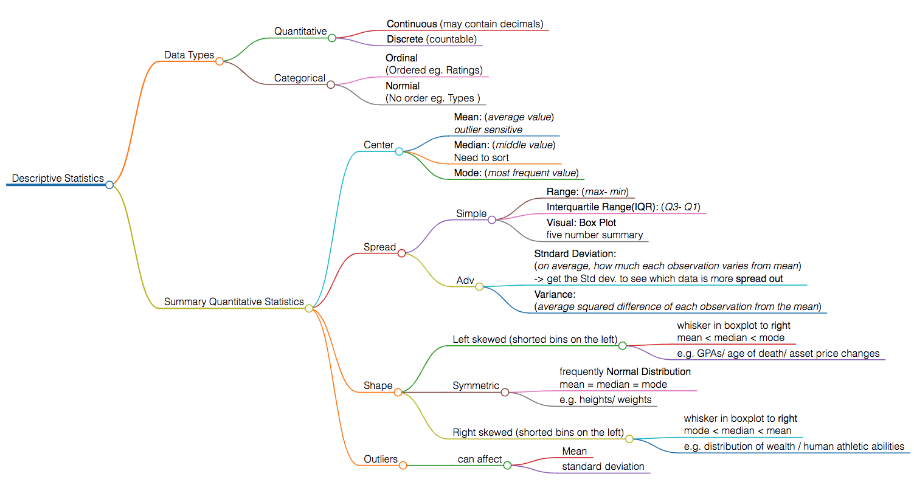

# Practical Statistics 
**Outline**
<ul>
<li><a href="#L1">Descriptive Statistics</a></li>
<li><a href="#L2">Probability</a></li>

****

## Descriptive Statistics
Descriptive Statistics is about describing our collected data. 
- mindmap as below ([Link](t1_descriptvie_statictics.html)) 

****

## Probability
- **Inferential Statistics** is about using our collected data to draw conclusions to larger population. 

   
  
  