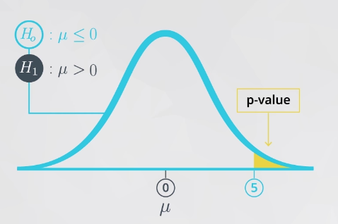
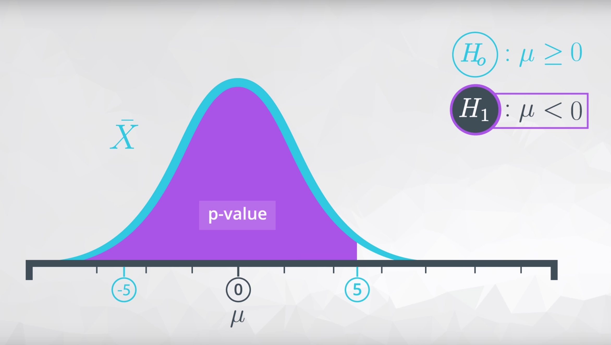

# Practical Statistics 
**Outline**
<ul>
<li><a href="#L1">Descriptive Statistics</a></li>
<li><a href="#L2">Probability</a></li>
<li><a href="#L3">Practical Statistics</a></li>
<li><a href="#L4">Hypothesis Testing</a></li>
</ul>

****

## Descriptive Statistics
Descriptive Statistics is about describing our collected data. 
- mindmap as below ([Link](Notes/MindMap/t1_descriptvie_statictics.html)) 

****

## Probability
- mindmap as below ([Link](Notes/MindMap/t2_probability.html)) 

**Additional**
- porbability generator: 
  - 1M test of three fair coin `np.random.randint(2, size=(int(1e6), 3))` 
  - 1M test of 3 unfaired coin `np.random.choice([0, 1], size=(int(1e6), 3), p=[0.6, 0.4])`
  * **Binomial Generator** each number of the results represents for the number of heads that resulted from each test of 10 coin flips. `np.random.binomial(n = 10, p = 0.5, size =20)` 

- Bayes rule  ([v1](https://www.youtube.com/watch?time_continue=85&v=b8M9CWxRyQ4&feature=emb_logo),[v2](https://www.youtube.com/watch?time_continue=10&v=aUFWZ2uJuBE&feature=emb_logo), [v3](https://www.youtube.com/watch?v=RgXQ8GRsjfc&feature=emb_logo), [v4](https://www.youtube.com/watch?time_continue=5&v=SdMk3aROgSc&feature=emb_logo))

- Normal Distribution ([v1](https://www.youtube.com/watch?time_continue=58&v=mQ_IjrtmmAk&feature=emb_logo), [v2](https://www.youtube.com/watch?time_continue=6&v=zqo1RJEHT_0&feature=emb_logo), [CLT](https://www.youtube.com/watch?time_continue=7&v=36KLIHioAvA&feature=emb_logo))

****

## Practical Statistics 
- mindmap as below ([Link](Notes/MindMap/../../MindMap/t3_practical_statistics.html)) 

**Additional**
- notation 
  
- **Theorem** 
  - Larger number theorem:
      >as our sample size increases, the sample mean gets closer to the population mean
     
  - Central Limit theorem:
      >with a large enough sample size the sampling dist. of the mean will be normally distributed.

**Confidence Internal**
- **Margin of error**: half the confidence interval width ( for example CI(31,37) then MOE = 3)
- increase sample size -> decrease the width of CI 
  increase confidence level -> increase the width of CI 
- **Interpretation**:
  Confidence intervals are for an **aggregate** about a population like a proportion or average.
  > **e.g.** We are 95% confident that proportion of users that click through using page A is higher than the average using page b.
  > **e.g.2**  We are 95% confident that on average the drug will work for the members of this specific population. 
****

## Hypothesis Testing 
- mindmap as below ([Link](Notes/../MindMap/t4_hypothesistesting.html)) 

Review([v1](https://classroom.udacity.com/nanodegrees/nd002/parts/bb0cbeb6-d3f8-4bae-9dc3-4abba3823e54/modules/82c7c576-88f5-43b6-80fc-c53378527a2d/lessons/ad8aca80-f444-4479-8848-5b07bafaf66c/concepts/2ff6c25f-c80a-4be2-912e-83639e98774e),[v2](https://www.youtube.com/watch?time_continue=97&v=sL2yJtHZd8Y&feature=emb_logo
))

- Hypothesis tests are about an entire population of interest 
**H0:** usually set up with an equal sign 
**H1:** generally what we want to prove to be true: a drug is effective, a new page performs better

### Types of Error 
&emsp; **Type I:** False Positive \(\alpha\)
> deiciding the alternative \(H_a\) is true, when actually the \(H_0\)  is true 

- Type I Paradox 
> **Bonferroni Correction**: $\frac{\alpha}{m}$ is a very conservative method for correcting the Type I error threshold when perfoming more than one hypothesis test. It says that the new type I error rate should be the error rate wanted to divide by he number of test performing. 

&emsp; **Type II:** False Negative \(\beta\)
> deiciding the null \(H_0\) is chosen when the \(H_a\) is actually true 

 

Common hypothesis tests

1. Testing a population mean <A href= "http://sites.utexas.edu/sos/guided/inferential/numeric/claim/one-sample-t/">(One sample t-test)</A>).

2. Testing the difference in means ([Two sample t-test](https://www.isixsigma.com/tools-templates/hypothesis-testing/making-sense-two-sample-t-test/))
3. Testing the difference before and after some treatment on the same individual ([Paired t-test](http://www.statstutor.ac.uk/resources/uploaded/paired-t-test.pdf))
4. Testing a population proportion ([One sample z-test](https://stattrek.com/statistics/dictionary.aspx?definition=one-sample%20z-test))
5. Testing the difference between population proportions ([Two sample z-test](https://onlinecourses.science.psu.edu/stat414/node/268))

 

<table>
<thead>
  <tr>
    <th colspan="2" rowspan="2">Confusion  Matrix</th>
    <th colspan="2">Decision</th>
  </tr>
  <tr>
    <td>Positive</td>
    <td> Negative</td>
  </tr>
</thead>
<tbody>
  <tr>
    <th rowspan="2"> Truth </th>
    <td>True</td>
    <td>TP</td>
    <td>TP</td>
  </tr>
  <tr>
    <td>False</td>
    <td>FP </td>
    <td>FN</td>
  </tr>
</tbody>
</table>

### Simulating 
* **Method 1**
  - bootstrap sample 
    `sample = np.random.choice(df.index, replace = True, size = 10000)`  
  - subset the data into $H_0$ and $H_1$
    $H_0$ : `sample.query(condition 0)`
    $H_1$ : `sample.query(condition 1)` 
  - get the mean, std 
    `np.std(h0_df) , np.mean(h0_df)`
* **Method 2**
  - simulate a binomial distribution 
    `np.random.normal(mu, sigma, size)` 
    $\downarrow$
    `normal_dist = np.random.normal(np.mean(h0_df - h1_df), np.std(h0_df - h1_df), 10000)` 
  - get the CI 
    `(np.percentile(normal_dist, 2.5), np.percentile(normal_dist, 97.5))`
### P value 
- **Definition**: 
  > the conditional probaility of observing the data given that if the null hypothesis is True. 
- **Types**  
  given the `s_mean` is the the mean from the null and 
  **`null_vals`** = `np.random.normal(mu, sigma, 1000)`

  <table class="tg">
<thead>
  <tr>
    <th >Types</th>
    <th >Details</th>
    <th >Calculation</th>
  </tr>
</thead>
<tbody>
  <tr>
    <td >one tail</td>
    <td ></td>
    <td>p =  <code>(null_vals > s_mean).mean())</code> </td>
  </tr>
  <tr>
    <td >two tails</td>
    <td ></td>
    <td>p =  <code>(null_vals < s_mean).mean() + (null_vals >null_mean +(null_means -smean)).mean()</code> </td>
  </tr>
  <tr>
    <td >more shaded</td>
    <td ></td>
    <td>p =  <code>(null_vals < s_mean).mean()</code>  </td>
  </tr>
</tbody>
</table>

- **Interpretation**
  samll p-values sugguest our null is not true. When the p-value is large, we have evidence that our statistics was likely to come from the null hypothesis. 
  - Avoid to use word **accept** when making statements regarding the null and alternative.   We are makeing decisions based on the likelilhood of the data comming from null hypothesis ith regard to the type I error threshold.
 
&emsp;&emsp;**$pval≤α⇒ $ Reject $H_0$**: Have statistically significant evidence to sugguest ... 
&emsp;&emsp;**$pval>α⇒$ Fail to Reject $H_0$** do not have statistically significant evidence to sugguest...
[notebook](PvalueCalculation.html)

- **Other Consideration**

