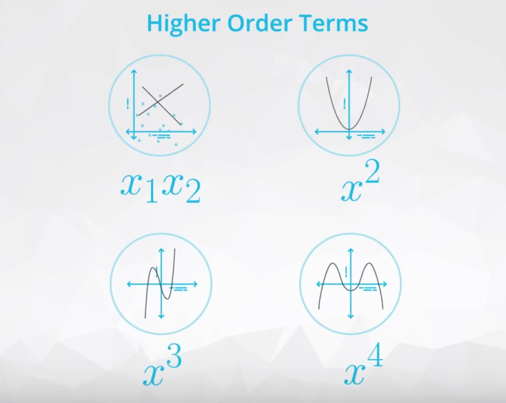

# Regressions
**Outline**
<ul>
<li><a href="#L1">Regression</a></li>
<li><a href="#L2">Multilinear Regression</a></li>
<li><a href="#L3">Logistic Regression</a></li>
<li><a href="#extra">Additional</a></li>
    <ul>
    <li><a href="#Lextra">Matrix and Numpy refresher</a></li>
    <li><a href="#Lextra2">Model assumptions and issues</a></li>
    <li><a href="#Lextra3">Confusion Matrix</a></li>
    </ul>
</ul>


****

<a id='L1'></a>
## Regression

- The most common way to visualize simple linear regression is using a scatter plot. 
#### Correlation Coefficient
  - Correlation coefficients provide a measure of the strength and direction of a linear relationship.
    - strength:  closeness of points 
    - direction: positive or negative 
  - **Calculation**:
    $r =
  \frac{ \sum_{i=1}^{n}(x_i-\bar{x})(y_i-\bar{y}) }{%
        \sqrt{\sum_{i=1}^{n}(x_i-\bar{x})^2}\sqrt{\sum_{i=1}^{n}(y_i-\bar{y})^2}}$
  - **Rule of thumb:** 
    - Strong relationship  $0.7≤∣r∣≤1.0$   
    - Moderate relationship $0.3≤∣r∣<0.7$
    - Weak relationship $0.0≤∣r∣<0.3$ 
    > Note: a correlation coefficient of 0 there is no **linear** relationship between two variables. 

#### Define the line 
* Component:
  - **intercept**: the predicted value of the response when the x variable is zero
  - **slope**: the predicted change in the response for every 1 unit increase in the x variable 
* Regression Line:
  - Method: MSE
  - minimize $\sum_{i=1}^{n}(y_i-\hat{y})^2$ 
  - find the minimum value of: for each data point in the dataset, look at the distance between the predicted and actual values, square these and sum them all together. 
  - Manual calculation
  

#### Code Practice and interpretation 

  ```
  import statsmodels.api as sm

  df['intercept'] = 1

  lm = sm.OLS(df.y, df[[x1, intercept]])
  result = lm.fit()
  result.summary()
  ```
Interpretation ([v1](https://www.youtube.com/watch?time_continue=13&v=eLk0XGGMaCE&feature=emb_logo),[v2](https://www.youtube.com/watch?time_continue=7&v=0vPtPAqMHJE&feature=emb_logo))


* **p-value:** 
  -> if the variable is statistically significant for predicting the dependent variable 
  > the p-value associated with area is very small, which sugguests there is a statistical evidence that population slope associated with area in relating to price is non-zero. 
* **R-squared:** 
  -> square of correlation coefficient, between 0 and 1 
     the more closer to 1, the better fit. 
  -> amount of varibility in the dependent variable y explained by the model.
   > e.g. 67.8% of the varibility in area can be explained by the price of a house. 
* **coef:**  
   > e.g. for ever one unit increase in area, the predicted increaase in price is 348.5.
* **intercept:**
   > e.g. Based on our predicted values, it would be unexpected to have a price below 9588, because this is the predicted price of a house with no area.
****

<a id='L2'></a>
## Multilinear Regression

Preview -> <a href="#Lextra">Matrix and Numpy refresher</a>

* **Build models**
  * through aclculation of matrix by the formular [in numpy](https://www.youtube.com/watch?time_continue=197&v=bvM6eUYyurA&feature=emb_logo)
    $\beta = (X^′X) ^−1X ^′y$  
    ```
    X= df [['intercept', x1, x2, x3]]
    Y = df.price
    np.dot(np.dot(np.linalg.inv(np.dot(X.transpose(), X)), X.transpose()),y)
    ```

* **Dummy variables**
  - the way to add `categorical` variables to multiple linear regression model by 1,0 encoding, must drop one of the column (the column dropped called `baseline`).
  **reason:**
    1. to assure that all of the columns are linearly independent 
    2. assure that the dot product of $X^′X$ is invertible  
    3. assure the X natrix is [full rank](https://www.cds.caltech.edu/~murray/amwiki/index.php/FAQ:_What_does_it_mean_for_a_non-square_matrix_to_be_full_rank%3F)
  -  Encoding 
     Create and need to Drop 
    `pd.get_dummies(df[categorical_var])`
     
* **Interpretation** ([v1](https://www.youtube.com/watch?time_continue=34&v=qRD3OVX8UMM&feature=emb_logo),[v2](https://www.youtube.com/watch?time_continue=159&v=TxP_TD0kbOo&feature=emb_logo))

* **coef:**  
  - Quantitative  
   For every one unit increase in X, the expected Y increases by the `slope`, holding all else constant. 
     > e.g. for ever additional unit increase in area of the house, the price is expected to increaase by 348.5 **as long as the other variables stay the same**.
  - Categorical 
    > We expect that a house in neighborhood C will cost 7168 less than a neighborhood A house, all else being equal.

* **<a href="#Lextra2">Potential Problems</a>**
  1. Linear relationship doesnt exists 
  2. Correlated errors 
  3. Non constant variance
  4. Outliers hurt the model 
  5. Multicollinearity

* **Multicollinearity Problem** 
  *Details described in addition table*
  - **Consequences:** direction flipped coefficients 
  - Scatterplot Matrix
    ```
    import searborn as sb
    sb.pairplot(df[['var1','var2','var3']])
    ``` 
  - **VIFs** [(Variance Inflation Factors)](https://etav.github.io/python/vif_factor_python.html)
    
    * **Calculation:**
      $VIF_i = \frac{1}{1- R_i^2}$
      - [Logic](https://www.youtube.com/watch?v=uiF3UcDWwPI&feature=emb_logo) 
       All other x-variables - excluding $x_i$ -> are used to predict $x_i$ then compute $R_i^2$
       if one related to other: 
       $R_i^2$ \(\uparrow\) then $1- R_i^2$\(\downarrow\) \(\therefore\)  VIFs \(\uparrow\)

    * **Code**: 
      if VIF> 10 then we have multicollinearity in model 

      ```
      from pasty import dmatrices
      from statsmodels.stats.outliers_influence import 
      
      variance_inflation_factor 
      y,X = dmatrices('price ~ intercept + area +bedrooms + bathrooms', df, return_type ='dataframe')

      vif = pd.DataFrame()
      vif["VIF factor"] = [variance_inflation_factor(X.values,i) for i in range(X.shape[1])]
      vif["features"] = X.columns
      vif
      ```
      and remove either with VIFs > 10 

* **Higher order terms**
  - **Why:** To help fit more complex relationship in data. 
  - **How:** Multiplying two or more x-variables by one another. Common higher order terms include:
    1. Multipled by itself: <ins>quadratics $(x_1^2)$ and cubics $(x_1^3)$  
    2. [interactions:](https://www.youtube.com/watch?time_continue=1&v=XV6S2srsdxw&feature=emb_logo) $(x_1 x_2)$
   - **When:** by the curves in the relatipnships between the y and x variable 
   - **Notice!!!**: we can not interprete the linear term the same way as before, becuase the variable is involved in the higher order term as well as the linear term
<table>
<thead>
  <tr>
    <th>Add</th>
    <th>Curve</th>
  </tr>
</thead>
<tbody>
  <tr>
    <td>quadratic</td>
    <td></td>
  </tr>
  <tr>
    <td>cubic</td>
    <td></td>
  </tr>
  <tr>
    <td>interaction</td>
    <td>
    <a href ="https://www.youtube.com/watch?v=uiF3UcDWwPI&feature=emb_logo">when use</a>: lines even cross or grow apart quickly.</td>
  </tr>
</tbody>
</table>
   
****

<a id='L3'></a>
## Logistic Regression
* **Basics** 
  used to predict only two possible outcomes 
* **Odds ratio** 
  $log(\frac{p}{1-p}) = b_0 +b_1x_1+ b_2x_2 +...$
  $\downarrow$
  $\displaystyle p= \frac{e^{b_0 +b_1x_1+ b_2x_2 +...}}{1+e^{b_0 +b_1x_1+ b_2x_2 +...}}$
  ($p:$ probability of category 1 occuring)
* **Interpretation:** ([v1](https://www.youtube.com/watch?time_continue=11&v=UPOxxbKu6CQ&feature=emb_logo),[v2](https://www.youtube.com/watch?time_continue=98&v=IY88UTiJltQ&feature=emb_logo))
   
  - if Coef. >=1 unit increase->  `np.exp(Coef.)`  
    if Coef. < 1, unit decrease->  reciprocal `1/np.exp(Coef.)`  

  - **Quantitative** Vars:
    - For every one unit increase in x1, we expect a multiplicative change in the odds of being in the one category of $e^{b_1}$, holding all other variables constant. 
    > For each 1 unit increase in duration, fraud is 0.23 `(np.exp(-1.46))` times as likely hodling all else constant. 

     Better this version using reciprocal : 
     > For each 1 unit decrease in duration, fraud is 4.32 `1/(np.exp(-1.46))` times as likely holding elase all else constant.

  - **Categorical** Vars:
    - When in category x1, we expect a multiplicative change in the odds of being in the one category by $e^{b_1}$ compared to the baseline. 
    > Fraud is 12.76`(np.exp(2.54))` times as likely on weekdays than weekends hodling all else constant. 

* **Model Fit**
  - Accuracy 
    

****
<a id='extra'></a>
## Additional 

<a id='Lextra'></a>
### 1. Matrix and Numpy refresher

 


<a id='Lextra2'></a>
### 2. Model Assumptions 

<table>
<thead>
  <tr>
    <th>Potential Problems</th>
    <th>Error</th>
    <th>Assess Methods<br></th>
  </tr>
</thead>
<tbody>
  <tr>
    <td rowspan="2">1. Non-linearity of the y and x </td>
    <td>- Linearity is that a linear model is the relationship that truly exists between the y variable and x variables. <br><span style="font-weight:bold">- Consequences: </span> <br>1. the predictions will not be very accurate <br> 2. the linear relationships associated with the coefficients aren't useful  </td>
    <td><span style="font-weight:bold;color:#00009B">a plot of residuals</span>  by the predicted values <code>(y−ŷ)</code>by predicted ŷ. <br>
    <li>curvature patterns : linear model might not fit (biased) <li>Expcted: random scatter</td>
  <tr>
    <td colspan="2">
    </td>
  </tr>
  </tr>
  <tr>
    <td>2. Correlation of error terms</td>
    <td><span style="font-weight:bold">- Description:</span> <br>Correlated errors frequently occur when our data are collected over time (like in forecasting stock prices or interest rates in the future) or data are spatially related (like predicting flood or drought regions).<br>We can often improve our predictions by using information from the past data points (for time) or the points nearby (for space).<br>
    <span style="font-weight:bold"> - Root Cause: </span> <br>not accounting for correlated errors is that you can often use this correlation to your advantage to better predict future events or events spatially close to one another. </td>
    <td><li><span style="font-weight:bold;color:#00009B">Durbin-Waston:</span> used to assess whether correlation of the errors is an issue </li>
    <li> <span style="font-weight:bold;color:#00009B">ARIMA or ARMA moels</span> : impleted to use this correlation to make better predictions</td>
  </tr>
  <tr>
    <td>3. Non-constant Variance and Normally Distributed Errors</td>
    <td><span style="font-weight:bold">- Description:</span><br> Non-constant variance is when the spread of your predicted values differs depending on which value you are trying to predict. This isn't a huge problem in terms of predicting well. <br><span style="font-weight:bold"> - Consequences: </span> <br>it does lead to confidence intervals and p-values that are inaccurate. Confidence intervals for the coefficients will be too wide for areas where the actual values are closer to the predicted values, but too narrow for areas where the actual values are more spread out from the predicted values. </td>
    <td><span style="font-weight:bold">- Test residuals plot:</span><br>
    <li> non-constant variance: is labeled as heteroscedastic <li>
    constnat variance: homoscedastic residuals (consistent across the range of values) <br>
    <span style="font-weight:bold;color:#00009B">Fix: a log </span>(or some other transformation of the response variable is done) in order to "get rid" of the non-constant variance. In order to choose the transformation, a <a href ="https://www.statisticshowto.com/box-cox-transformation/"> Box-Cox</a> is commonly used.<br>
</td>
  </tr>
  <tr>
    <td>4. Outliers/Leverage points</td>
    <td>Outerliner: points that lie far away from the regular trends of the data. <br><span style="font-weight:bold"> - Consequences: </span> <br>If we are aggregating data from multiple sources, its possible that some of the data values were carried over incorrectly or aggregated incorrectly. </td>
    <td><span style="font-weight:bold;color:#00009B">Regularization</span></td>
  </tr>
  <tr>
    <td>5. Multicollinearity</td>
    <td><span style="font-weight:bold">- Description:</span><br> when we have x variables are correlated with one another. <br><span style="font-weight:bold"> - Consequences: </span> <br>One of the main concern of multicollinearity is that it can lead to coefficients being flipped from the direction we expected from simple linear regression</td>
    <td><span style="font-weight:bold;color:#00009B">Bivariate plots</span> or <span style="font-weight:bold;color:#00009B">Variance inflation factor <a href ="https://www.youtube.com/watch?time_continue=15&v=wbtrXMusDe8&feature=emb_logo"> (review: VIF</a><a href ="https://www.youtube.com/watch?time_continue=15&v=wbtrXMusDe8&feature=emb_logo">, 2)</a></span>  if VIF> 10 then we have multicollinearity </td>
  </tr>
</tbody>
</table>

*VIF $VIF_i = \frac{1}{1- R_i^2}$

<a id='Lextra3'></a>
### 3. Confusion Matrix 
<table>
<thead>
  <tr>
    <th colspan="2" rowspan="2">1</th>
    <th colspan="2">Actual Class</th>
    <th colspan="2">2</th>
  </tr>
  <tr>
    <td>Positive</td>
    <td>Negative</td>
    <td>3</td>
    <td>4</td>
  </tr>
</thead>
<tbody>
  <tr>
    <td rowspan="2">Predicted <br>Class</td>
    <td>Positive</td>
    <td>TP<br>s</td>
    <td>FP<br>Type I error</td>
    <td>Precision <br>TP /(TP+FP)</td>
    <td>5</td>
  </tr>
  <tr>
    <td>Negative</td>
    <td>FN<br>Type II error</td>
    <td>TN<br>a</td>
    <td>6</td>
    <td>7</td>
  </tr>
  <tr>
    <td colspan="2" rowspan="2">8</td>
    <td>Recall<br>TP/(TP+FN)</td>
    <td>10</td>
    <td>12</td>
    <td>14</td>
  </tr>
  <tr>
    <td>9</td>
    <td>11</td>
    <td>13</td>
    <td>15</td>
  </tr>
</tbody>
</table>

- **Recall** / True Posotive Rate/ Sensitivity
  how many relevent items are selected? 
  $\frac{True\ positive}{Total\ Positive} $ = $ \frac{TP}{TP+FN}$
  <br>
- **Precision**/ Positive Predictive Value
  how many selected iteams are relevent?
  $\frac{True\ positive}{Total\ Predicted\ Positive} $ = $\frac{TP}{TP+FP}$