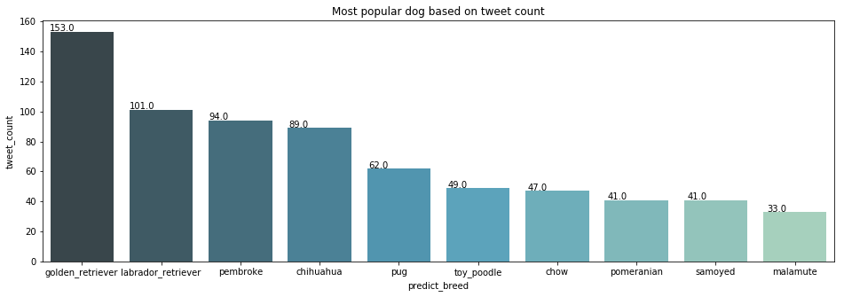
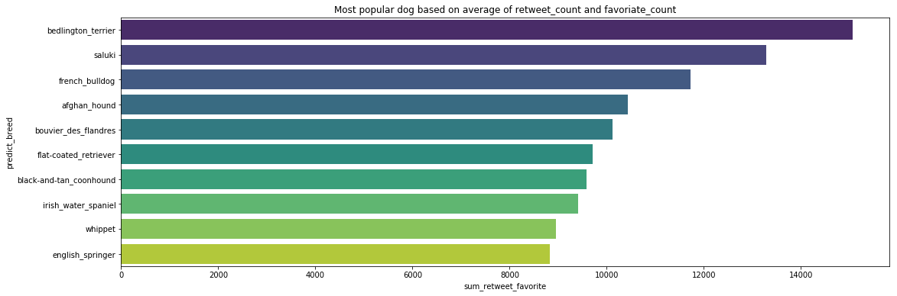
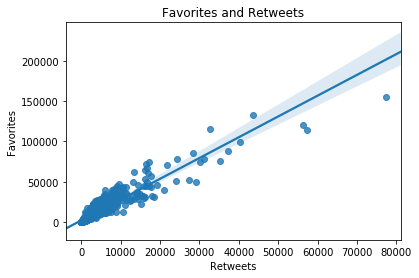
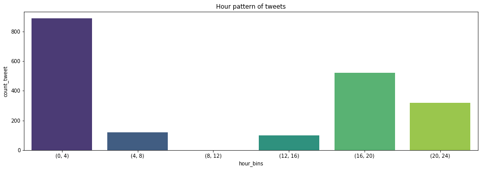

# Wrangle and Analyze Data
This project aims to use Twitter data to create interesting and trustworthy analysis and visualizations. 


## Table of Contents

<ul>
<li><a href="#Intro"> Part I: Introduction</a></li>
 <ul>
    <li><a href="#Datasource">1. Data Sources</a>  
    <li><a href="#libraries"> 2. Frameworks and Libraries</a>
 </ul>
<li><a href="#T2">Part II: Data Wrangling</a></li>
<ul><li><a href="#T2_1">1. Data Gathering</a>  
    <li><a href="#T2_2">2. Data Assessing</a>  
    <li><a href="#T2_3">3. Data Cleaning</a>  
    <li><a href="#T2_4">4. Store</a>  
</ul>
<li><a href="#Summary">Part III: Analyze</a></li>
<ul><li><a href="#Visuals">1. Visualizations</a>  
    <li><a href="#Conclusions">2. Conclusions</a>
</ul>
</ul>
<a id='Intro'></a>
## Part I: Introduction
<a id='Datasource'></a>

### 1. Data Sources   
1. `twitter_archive_enhanced.csv`:    
The WeRateDogs Twitter archive [twitter_archive_enhanced.csv](https://d17h27t6h515a5.cloudfront.net/topher/2017/August/59a4e958_twitter-archive-enhanced/twitter-archive-enhanced.csv)

2. `image_predictions.tsv`:  
The tweet image predictions, i.e., what breed of dog (or other object, animal, etc.) is present in each tweet according to a neural network. This file (image_predictions.tsv) is hosted on Udacity's servers and should be downloaded programmatically using the Requests library and the [URL](https://d17h27t6h515a5.cloudfront.net/topher/2017/August/599fd2ad_image-predictions/image-predictions.tsv).

3. `tweet_json.txt`:   
Each tweet's retweet count and favorite ("like") count at minimum, and any additional data you find interesting. Using the tweet IDs in the WeRateDogs Twitter archive, query the Twitter API for each tweet's JSON data using Python's Tweepy library and store each tweet's entire set of JSON data in a file called tweet_json.txt file. Each tweet's JSON data should be written to its own line. Then read this .txt file line by line into a pandas DataFrame with (at minimum) tweet ID, retweet count, and favorite count. 

<a id='libraries'></a>
### 2. Frameworks and Libraries
```
import os
import pandas as pd
import numpy as np 
import requests 
import tweepy 
import json
import matplotlib.pyplot as plt 
import seaborn as sns
import re 
import configparser             
import pandas.api.types as ptypes   # test data type 
% matplotlib inline 
```
Settings
```
# The twitter text column contains long content so set the display to 100 to print long string
pd.set_option('max_colwidth',200)
pd.set_option('max_columns',50)
```

**** 
<a id='T2'></a>
## Part II: Data Wrangling
<a id='T2_1'></a>
### 1. Data Gathering
#### Steps:
1. Read local data `twitter_archive_enhanced.csv`.   
2. Access online `image_prediction.tsv` data using Requests library.   
3. Query Twitter API for `tweet_json.txt` data. 


<a id='T2_2'></a>
### 2. Data Assessing
This section aims to visually and programmatically assess the data for `quality` and `tidiness` issues. 

**Assessing Summary**
* **1.Quality**   

    *`df_twiteer`* table:
        - Erroneous datatype (timestamp string)    
        - The Source column contains HTML code 
        - Incorret lower case words in Name column 
        - Some of the dogs are not classified (doggo, floofer, pupper, or puppo)
        - Some of the ratings in both rating_numerator and rating_denomirator are out of range 
        
    *`df_image`* table:
        - Contain retweets duplicated content from column jpg_url   
        - Multiple data format (upper and lower cases) in column p1 p2 and p3  
        - Some records show pictures are not dogs    
    *`df_api`* table:
        - List object in display_text_range column  
        
* **2. Tidiness** 

    *`df_twiteer`* table:
        - Columns doggo, floofer, pupper,and puppo should in one column as they present same attribute information  
         
    *`df_image`* table:
        - Prediction Algorithm results p1 - p3 can be reduced in one dimension 
    *`df_api`* table:
        - display_text_range column contains min and max information in one column

### 3. Data Cleaning
**Define Cleaning steps:** 
1. Merge three tables 

2. Change the datatype of Timestamp to datetime
3. Extract HTML code in Source column  
4. Remove incorrect text in Name column
5. Merge doggo, floofer, pupper, and puppo in one column 
6. Remove records which in_reply_to_status_id and retweeted_status_id is not null, dont contain images or images dont display dogs
7. Convert the data format for columns p1 to p3 into same lower case format 
8. Clean the ratings 
9. Reduce the prediction columns into two dimension:  Breed and conf 
10. Extract the min and max display text from display_text_range column 
11. Change datetype of "retweet_count", "favorite_count", "img_num" to int

**Clean and test code in link-> [`wrangle_act.ipynb`](Wrangle-Analyze-Data/wrangle_act.ipynb)** 

**** 
<a id='Summary'></a>
## Part III: Analyze
**Questions**:  
1. Which breed of dog is most popular overall based on the rating and number of retweets? 
2. Is there a correlaion between count of retweets and count of of favorite? 
3. Is there a pattern visible in the timing of the tweets? 





**Insight 1:**   
We found that the list of popular breed based on **retweet count** doesnt quite overlap with the list of popular breed based on the **average of retweet_count and favoriate_count**.    



**Insight 2:**  
It seems like Retweets and Favorites are highly correlated and the above plot. The count of facoriates sync positively with the count of retweets.

**Insight 3:**
As we can see in he graph, the most posts are during the midnight between 0-4 o'clock, followed by 16 - 20 o'clock.

<a id='Conclusions'></a>
### Conclusions
In this project we went through a whole data wrangling process. The gathering included the programmatical, manual download as also the gathering via an API. Also the cleaning part covered a lot of techniques like regular expressions or the overall handling of dataframes.
